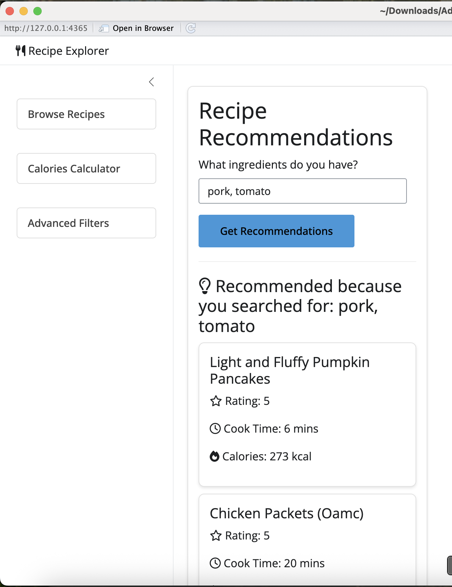
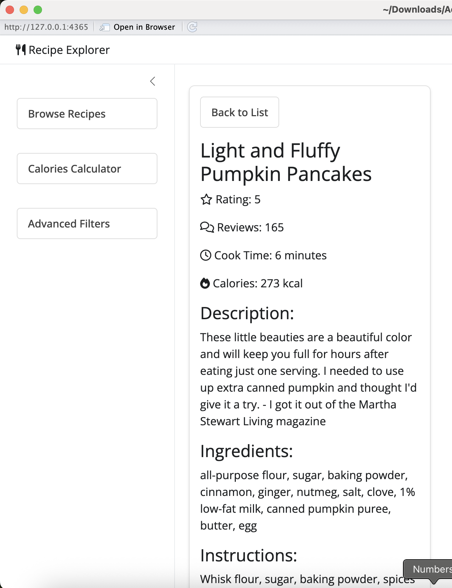
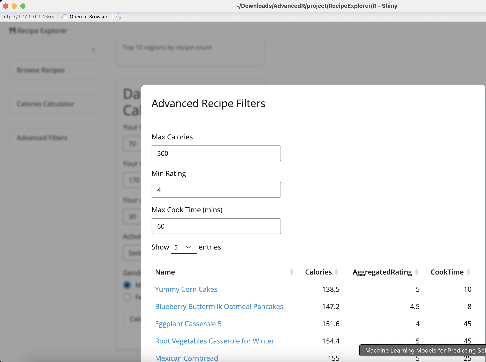
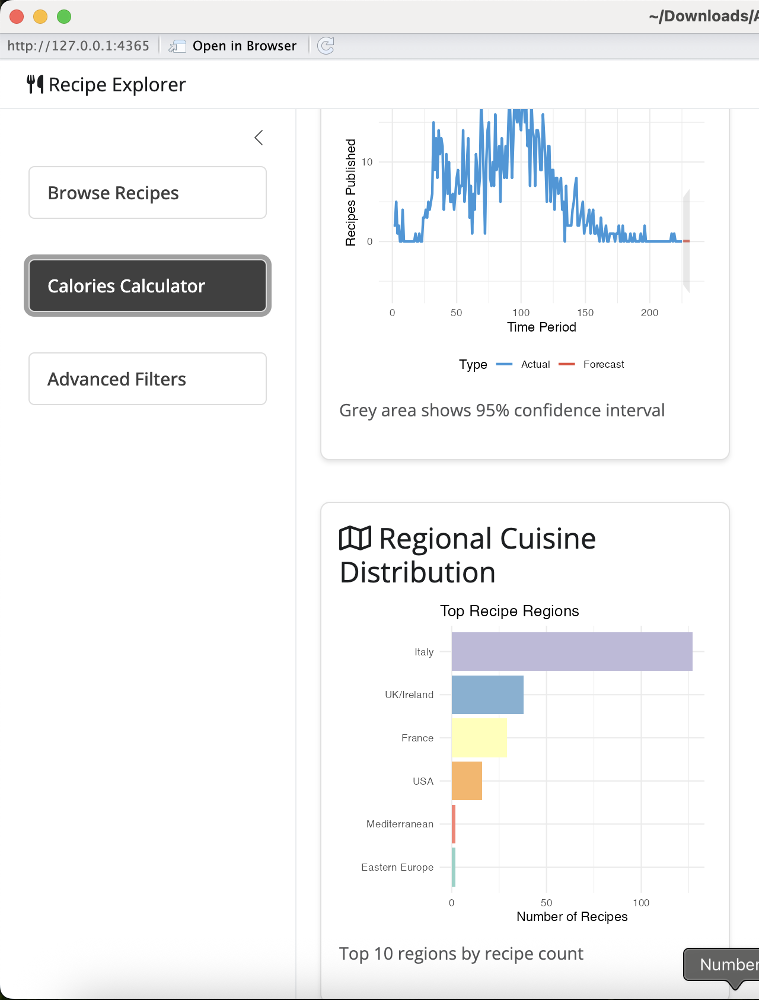
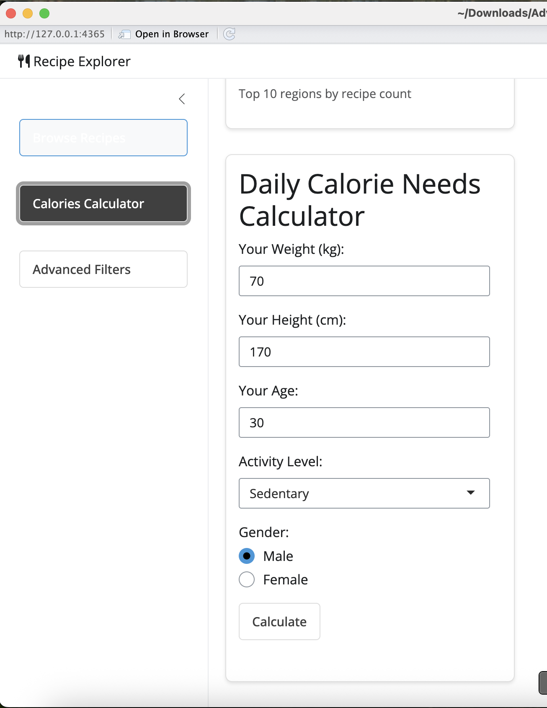

# 🥘 Recipe Explorer: Smart Meal Ideas from Your Existing Ingredients

**Recipe Explorer** is an interactive R-based application and package that helps users discover creative recipes based on the ingredients they already have at home. It leverages association rules, time parsing, and interactive dashboards to reduce food waste, save money, and spark cooking inspiration.

**To filter the recipe with owned ingredients, relevant results may be provided despite not having the EXACT ingredients**


**Once clicked into any recipe, its content will be shown**


**If simple filter is unable to satisfy your needs, you may use advanced filter if you have any special diet preference, e.g. calories intake control, or a very fast-to-make meal when you are STARVING and not have all day to cook!**


**Well, if you are curious about which cuisine dominates the recipe pool, you may refer to this regional cuisine distribution**


**Finally, if you are on strict diet control, or wish to gain weight healthily, you would need to know how much you should/should not take**


---

## 🚀 Overview

| For Users | For Developers |
|-----------|----------------|
| 🔍 Find recipe ideas using leftover or limited ingredients | 🔗 Built with modular, reusable R package structure |
| 📊 Visualize ingredient combinations and trends | 🧠 Uses Apriori algorithm for ingredient association |
| 💡 Get creative ideas beyond exact keyword matches | ⚙️ Implements defensive programming and testing |
| ⏱️ Save time and reduce waste with smart filters | 🧪 Includes unit testing via `testthat` |
| 🌍 Explore spatial and time-based food trends *(extra)* | 🚀 Accelerated with Rcpp and structured for future scaling |

---

## 🧩 Key Features

---

## 🧠 How Recipe Discovery Works with Apriori

The **Apriori algorithm** is a powerful data mining technique used to uncover frequent patterns or associations among items. In this project, it identifies **commonly co-occurring ingredients** across many recipes — allowing users to:

- Discover recipes using **partial ingredient matches**
- Find **recommended ingredient combinations** that go well together
- Explore creative dishes that use **what you already have**

For example, if you input “eggs” and “flour,” Apriori might suggest recipes that also include “milk” or “sugar,” based on frequent patterns learned from the dataset.

---

### ✨ Core Functionality
- **Ingredient-based search** using Apriori association rules
- **Shiny app dashboard** for interactive filtering and exploration
- **Time converters** to handle ISO 8601 format (`PT1H30M`, etc.)
- **Defensive programming** for error-safe data validation

### 🛠️ Advanced R Techniques
- Custom R functions with defensive checks
- Vectorization for performance improvements
- Use of S3/S4/R6 where appropriate (OOP in R)
- Integration of Rcpp for fast computation
- Tidyverse for clean and efficient data wrangling
- Time Series forecasting (monthly trends, 6-month forecast)
- Spatial data processing *(extra)*
- `testthat` for unit testing
- Designed as an **R package**, allowing reusability and collaboration

---

## 📦 Project Structure

This project follows a standard **R package** structure:

```
recipeexplorer/
├── DESCRIPTION
├── NAMESPACE
├── R
|   ├── app.R
|   ├── recipe_analyzer.R
|   ├── RcppExports.R
├── data/
├── man/
├── src/
├── tests/
├── .gitignore
├── .Rbuildignore
├── RecipeExplorer.Rproj
```
---

## 🧪 Sample Custom Functions

- `remove_outliers(df)` — Removes outliers from numeric "Content" columns using IQR.
- `converter(df1)` — Converts ISO 8601 strings (e.g., `PT1H30M`) into decimal hours.
- `verify_time_consistency(df)` — Validates if `CookTime + PrepTime == TotalTime`.
- `iso8601_to_minutes(duration)` – Converts ISO 8601 durations into minutes, with edge case handling.
---

## 📈 Future Improvements

- Expand dataset for broader ingredient and recipe variety
- Integrate deep learning for enhanced predictions
- Add voice assistant compatibility (e.g., Alexa, Siri)
- Enhance geospatial analysis with interactive mapping
- User feedback loop for recipe refinement

---

## 📥 Installation & Run

You can clone the repository and run the app locally:

```r
# Clone the repo
git clone https://github.com/YOUR_USERNAME/recipe-explorer.git

# In R
setwd("path/to/recipe-explorer")
shiny::runApp("R/app.R")

`This project reflects experience in R, Shiny, machine learning, data mining, and end-to-end app development.`
